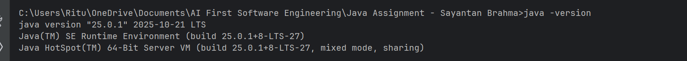
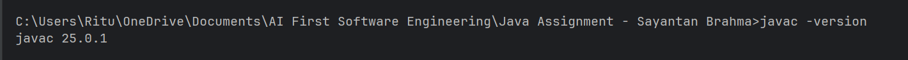
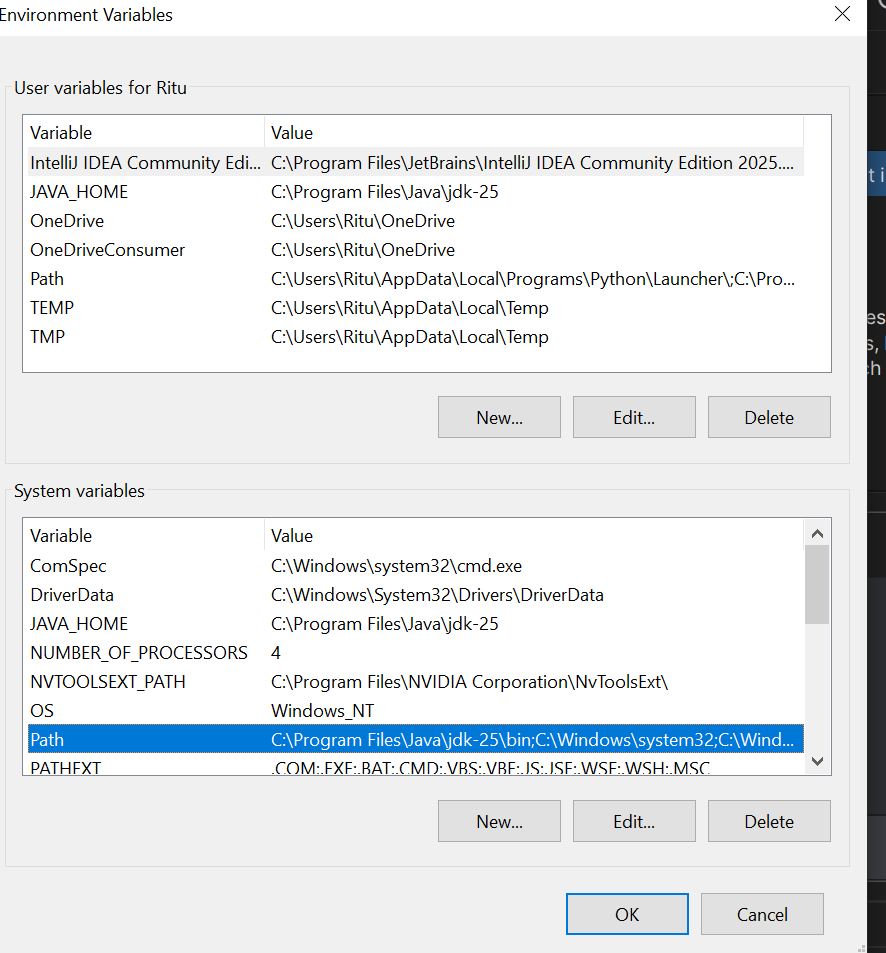

# Setup Instructions

This document explains how to install Java, compile the project, and run the MediTrack application.

## 1) Install and Configure Java (JDK)

### Windows
1. Download a JDK (e.g., Oracle JDK 17 or more).
2. Run the installer and complete setup.
3. Set environment variables:
   - JAVA_HOME = JDK install path (example: C:\Program Files\Java\jdk-17)
   - Add %JAVA_HOME%\bin to Path
4. Verify:
```powershell
java -version
javac -version
```
5. Screenshots
JAVA Version


JAVAC VERSION


Environment Variables


## 2) Compile the Project

From the project root:

### PowerShell (Windows)
```powershell
cd  <drive path>\Java Assignment - Sayantan Brahma
javac -d out (Get-ChildItem -Recurse src -Filter *.java | ForEach-Object { $_.FullName })
java -cp out com.airtribe.meditrack.Main
```


## 3) Run the Application

### Normal Run
```powershell
cd  <drive path>\Java Assignment - Sayantan Brahma
javac -d out (Get-ChildItem -Recurse src -Filter *.java | ForEach-Object { $_.FullName })
java -cp out com.airtribe.meditrack.Main
```

### Run with CSV Load
```powershell
cd  <drive path>\Java Assignment - Sayantan Brahma
javac -d out (Get-ChildItem -Recurse src -Filter *.java | ForEach-Object { $_.FullName })
java -cp out com.airtribe.meditrack.Main --loadData
```

## 4) Data Files

The app reads/writes CSV files in the working directory:
- doctors.csv
- patients.csv
- appointments.csv

If you run from `src`, the files will be created in `src`.

